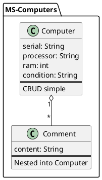

# MS-COURSE

Micro service pour gérer les ordinateurs et leurs commentaires.

## Dépendances

- Spring Boot
- Spring Data MongoDB
- Spring Web
- Lombak
- Docker

## Installation

- Cloner le projet
- Démarrez la base de données MongoDB avec Docker `docker-compose up -d`
- Lancer le projet avec la commande `mvn spring-boot:run`

## Schema de la base de données

## API

### Swagger

Le swagger est disponible à l'adresse suivante :
- http://localhost:8080/api-docs

